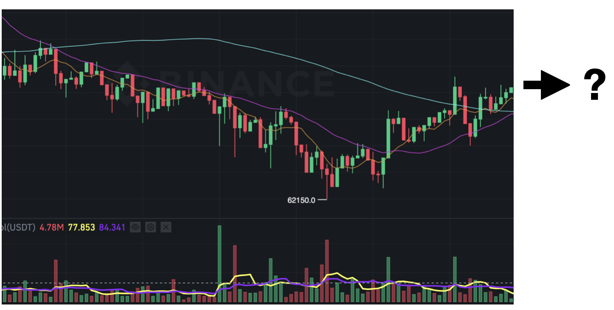
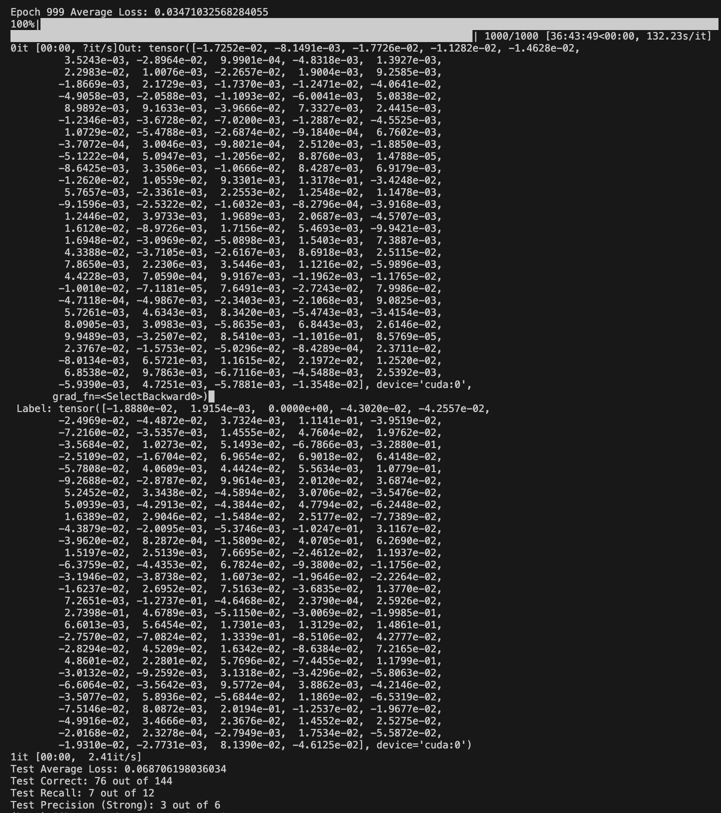

# AutoBinance

This project aims to apply deep learning (Transformer-based models, in particular) methodologies for the real-time trading on cryptocurrency market.

Model is trained on the public data provided by Binance, and actual trading is executed on BTCUSDT Futures market on Binance, leveraging the pre-trained model.

## Project Goal

Correctly and precisely predict the `rate of price change after 1 minute`, based on the `previous 100 minutes kline data`.




## Preliminary

To begin with, clone this repo using the following command.
```
git clone https://github.com/JihoonBrianJun/AutoBinance.git
cd AutoBinance
```

Python packages used for this project can be replicated by the following command.
```
pip install -r requirements.txt
```

## Data

Raw data files can be either downloaded directly from Binance (https://www.binance.com/landing/data), or using the Binance API.

Data products used in this project is `Kline`(1-minute interval OHLCV data).

By default, this project uses Jan/01/2024 ~ April/09/2024 (100 days) data for training & validation.

Raw data files used for training in this project can be downloaded using the following command.
```
cd data/utils
python3 download-kline.py
```

## Data Preprocessing Pipeline
To be updated


## Train result

You can train the model using the following command:
```
python3 train.py
```

Model configurations are shown in the table below.

|Hidden dimension (Transformer)|# heads|# Enc/Dec layers (Each)|
|---|---|---|
|512|8|6|

Train hyperparameters is summarized in the following table.

|# epoch|Batch Size|Learning Rate|Gamma (for StepLR)|
|---|---|---|---|
|1000|200|1e-5|0.999|

After training, metrics evaluated on validation data were as follows:

(To be updated)

<!--  -->


## Metrics

0. MSE Loss
    * Mean Squared Error between the predicted price change rate and the actual price change rate.

    * Since target value has been multiplied by 10 prior to training, one should multiply $1 \over 10$ to the printed MSE Loss to observe the actual MSE Loss.


1. Correct Rate
    * Correct if predicted direction and the actual direction coincides, otherwise incorrect.


2. Recall
    * ${Num \ of \ correct \ predictions \ for \ cases \ in \ denominator} \over {Num \ of \ price \ increase \ greater \ than \ threshold}$


3. Precision (Strong)
    * ${Num \ of \ price \ increase \ among \ cases \ in \ denominator} \over {Num \ of \ model \ prediction \ greater \ than \ threshold}$


## Real-time Evaluation Result
One can run Real-time evaluation using Binance API and pre-trained model by the following command:
```
python3 real_time_predict.py
```

(To be Updated)

<!-- Model performance was further checked based on real-time orderbook and trade data of Top 10 cryptocurrencies (sorted by market cap) from Upbit. Each experiment was 3 hour in duration, and we underwent total 2 experiments until now.


### Experiment 1

|Market Code|MSE Loss|Correct Rate|Recall|Precision (Strong)|
|---|---|---|---|---|
|KRW-BTC|0.2424|31 out of 33|7 out of 7|0 out of 0|
|KRW-ETH|0.3393|25 out of 34|6 out of 7|0 out of 0|
|KRW-SOL|0.5292|28 out of 33|11 out of 12|0 out of 0|
|KRW-XRP|0.3998|29 out of 33|7 out of 7|0 out of 0|
|KRW-ADA|Code Error|-|-|-|
|KRW-AVAX|0.6953|31 out of 34|13 out of 13|0 out of 0|
|KRW-DOGE|0.5734|27 out of 33|9 out of 9|0 out of 0|
|KRW-TRX|Code Error|-|-|-|
|KRW-LINK|Code Error|-|-|-|
|KRW-DOT|0.4794|23 out of 36|23 out of 36|0 out of 0|


### Experiment 2

|Market Code|MSE Loss|Correct Rate|Recall|Precision (Strong)|
|---|---|---|---|---|
|KRW-BTC|0.3372|28 out of 32|5 out of 5|0 out of 0|
|KRW-ETH|0.4149|22 out of 33|7 out of 8|0 out of 0|
|KRW-SOL|0.7181|29 out of 32|15 out of 15|0 out of 0|
|KRW-XRP|0.4462|30 out of 32|9 out of 10|0 out of 0|
|KRW-ADA|0.7193|15 out of 34|9 out of 15|0 out of 0|
|KRW-AVAX|0.7319|32 out of 33|8 out of 9|0 out of 0|
|KRW-DOGE|0.6005|30 out of 33|9 out of 9|0 out of 0|
|KRW-TRX|Code Error|-|-|-|
|KRW-LINK|0.5485|27 out of 34|6 out of 6|0 out of 0|
|KRW-DOT|0.5779|25 out of 34|12 out of 14|0 out of 0|

 -->